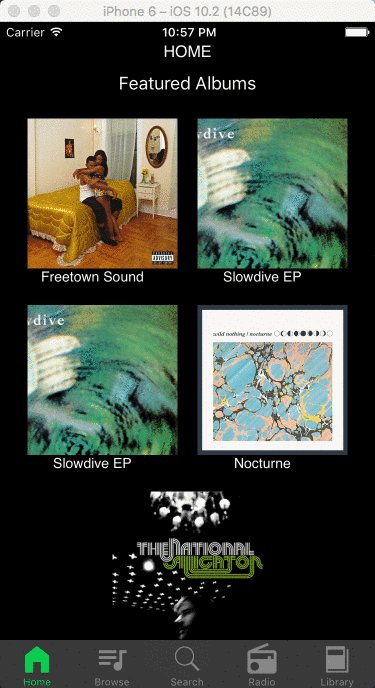
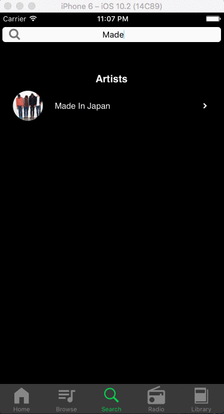

#   BeatHub 

##### Built with React Native 
Mobile version of [BeatHub](https://github.com/jestir1234/BeatHub), a music streaming application inspired by Spotify.


### Features and Implementation

#### Authentication
Frontend authentication performed through RESTful calls to the same Rails backend for [BeatHub](http://www.beathub.us). Users can sign-up through the mobile app and login through the web platform, and vice-versa.

#### Custom Stack Navigator

Implements a stack for easy navigation when visiting each tab (i.e. Home, Browse, Search, Radio, Library). The state of the stack is stored in the TabBar component and the following callback is passed down as a prop to its child components.

```
changeTab(tab, tabProps, action){
  LayoutAnimation.configureNext(CustomAnimation)
  let navStack = this.state.navStack.slice()
  if (action === 'push'){
    navStack.push({tab: tab, tabProps: tabProps})
    this.setState({
      tab: tab,
      tabProps: tabProps,
      navStack: navStack
    })
  } else if ( action === 'pop'){
    navStack.pop()
    let previous = navStack[navStack.length - 1]
    this.setState({
      tab: previous.tab,
      tabProps: previous.tabProps,
      navStack: navStack
    })Â
  }
}
```


#### Search
Similar to the web version, each input into the search bar queries the database for partial matches for Artists, Albums, and Songs.

```
_handleInput(text){

  this.setState({searchInput: text, animating: true},
    () => fetch(`http://www.beathub.us/api/search?query=${this.state.searchInput}`, {
    method: "GET"
  })
  .then((response) => response.json())
  .then((responseJSON) => {
    this.setState({searchResults: responseJSON, animating: false})
  }).catch(function(error){
    console.log(`Got an error: ${error}`)
  }))
}
```

#### Custom Audio Player
Audio player component rendered within parent component UserHomeScreen so user can navigate through different tabs without interrupting the audio. Uses callbacks to update the current time in the song and increment the width of the 'time-line' (visual representation of the current time). Users can touch any point on the line to skip around the track.

```
getCurrentPosition(e){
  var {height, width} = Dimensions.get('window');
  let pos = e.nativeEvent.locationX;
  let posPercentage = pos / width;
  let newCurrentTime = Math.floor(posPercentage * this.state.duration);
  this.player.seek(newCurrentTime)
}
```



#### Radio
Selecting the Radio tab will fetch a random queue of songs and store it in the parent component UserHomeScreen. Users can skip to the next song in the queue or go back. Skipped songs are kept in a 'played' array.


#### Playlists
Users can create/delete playlists.

#### Follow Artists
Users can follow artists they like.

#### Existing web features to be completed for mobile
- Users can add songs to playlists
- Users can follow albums, playlists, and other users
- Users can edit their playlists

#### Mobile features to be completed
- Display number of followers for Artists, Albums, Playlists, and Users
- Messaging between users
- Listening parties
